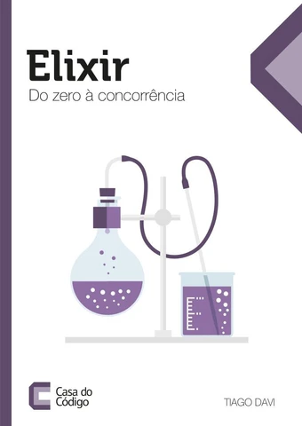
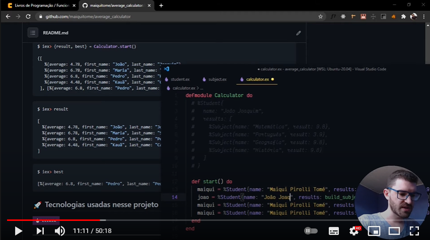

<div align="center">
  <h1>🧮 Calculadora de Médias 🧮</h1>
  <h2>
    Primeiro projeto do livro: Elixir do zero a concorrência (Casa do Código)
  </h2>

  <br>
  
  <br>
  <br>

  <a href="https://www.youtube.com/watch?v=ikPlQ4UxP2w&t=291s">
    Assista a video aula do projeto
    
  </a>

  <br>
  <br>
</div>

O objetivo desta aplicação é bastante simples. Dado que eu
passe uma lista de estudantes com suas notas, ela deve ser capaz de
me retornar uma lista dos estudantes com suas médias. Além disso,
ela também precisa me informar qual foi a melhor média da classe.

A estrutura de um aluno ficou assim:
```elixir
%Student{
  name: "João Joaquim",
  results: [
    %Subject{name: "Matemática", result: 9.8},
    %Subject{name: "Português", result: 3.9},
    %Subject{name: "Geografia", result: 9.8},
    %Subject{name: "História", result: 9.8}
  ]
}
```
<br />

## 💻 Iniciando o Projeto

Compilando todos os	módulos dentro do diretório do projeto:

```bash
$ elixirc calculator.ex student.ex subject.ex
```
Depois de compilar todos os módulos, alguns arquivos com a extensão	**.beam**	serão	gerados	no diretório. Estes são arquivos de bytecode	que	a	máquina	virtual	vai	executar.

Como todos os módulos estão compilados dentro da mesma pasta, o __IEx__ pode ser chamado dentro	desta	 pasta e ele automaticamente terá	acesso a todos eles.

```bash
$ iex
```

Vamos então executar o __start principal__ para vermos o resultado. Faremos __Pattern Matching__ do	 resultado para uma variável __result__ com	o	resultado	geral, e __best__ para os	melhores.

```bash
$ iex> {result, best} = Calculator.start()

{[
   %{average: 4.78, first_name: "João", last_name: "Joaquim"},
   %{average: 6.78, first_name: "Maria", last_name: "Silva"},
   %{average: 6.8, first_name: "Pedro", last_name: "Pedrada"},
   %{average: 4.48, first_name: "Kauã", last_name: "Camboinhas"}
 ], [%{average: 6.8, first_name: "Pedro", last_name: "Pedrada"}]}
 ```

```bash
$ iex> result

[
  %{average: 4.78, first_name: "João", last_name: "Joaquim"},
  %{average: 6.78, first_name: "Maria", last_name: "Silva"},
  %{average: 6.8, first_name: "Pedro", last_name: "Pedrada"},
  %{average: 4.48, first_name: "Kauã", last_name: "Camboinhas"}
]
```

```bash
$ iex> best

[%{average: 6.8, first_name: "Pedro", last_name: "Pedrada"}]
```

## 🚀 Tecnologias usadas nesse projeto


<hr>
Made with ♥ by Maiqui Tomé 😀
<br /><br />

*Reach out to me* 👇

[](https://codepen.io/maiquitome)
[](https://www.youtube.com/channel/UCoXn0XyxLsKpIE5px0UNuEw)
[](https://medium.com/@maiquitome)
[](https://www.linkedin.com/in/maiquitome)
[](https://www.instagram.com/maiquitome)
[](https://www.facebook.com/maiquitome)
[](https://twitter.com/MaiquiTome)
